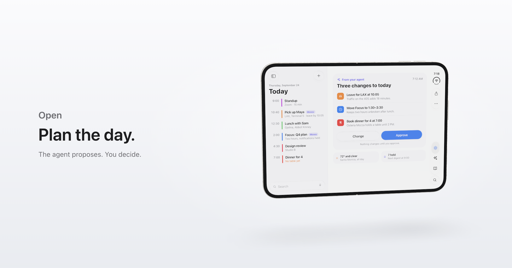

# iOS 27 Duo Kit

**iPhone Duo and iOS 27, built on the web.** A 3D model of Apple's foldable that folds, its system UI in HTML and SVG, and Liquid Glass rendered in WebGL and fitted, level by level, to what the iOS 27.1 simulator draws. See it live at **[duo.renocrypt.com](https://duo.renocrypt.com/)**.

[](https://duo.renocrypt.com/)

The kit is a template. Developers, and the AI agents they work with, start from it to build landing pages for apps and concept mockups that look like iPhone Duo because they are built to its numbers: the device from Apple's own AR model, the bars and status from Apple's iOS 27 UI Kit, the glass from the simulator itself. Its first showcase is [**a day with Duo**](https://duo.renocrypt.com/), a scroll-driven story that follows one day across the device's poses.

## What is in the kit

- **The device.** A physically modelled iPhone Duo in Three.js, rebuilt from measurements of Apple's AR model: its silhouettes match within an IoU of 0.998 to 0.9999 in eight views and both poses. It folds through every angle, with the inner display bending as an elastica and a hinge that never collides.
- **Liquid Glass.** A WebGL compositor with lensing, two-scale frost, tone curves, rim, and hairline, calibrated against the iPhone Duo simulator by a probe app of our own: tone within 1.4 levels, lensing within 1 pt, frost that grows with the glass's short side as iOS's does. How it works, and what it took to measure: [`docs/liquid-glass.md`](docs/liquid-glass.md).
- **Duo's system UI.** The side rail, status, groups, tab bar, sheets, and Duo's poses (Closed, Open, Book, Standing, Seated) in plain DOM and SVG, to the numbers of Apple's iOS 27 UI Kit: [`docs/duo-ui.md`](docs/duo-ui.md). The glyphs are ours, drawn to SF Symbols' extents and weights.
- **Design tokens** in DTCG JSON, every value labelled with its source.

Everything you see at [duo.renocrypt.com](https://duo.renocrypt.com/) is drawn by this code; none of Apple's files are in the repository.

## Run it

```sh
cd app
npm install
npm run dev     # http://127.0.0.1:5190/
npm run check   # tokens, types, the hinge sweep, the production build
```

The screens are drawn with HTML-in-Canvas, which Chrome has behind a flag (an origin trial as of September 2026). Turn on `chrome://flags/#canvas-draw-element` and relaunch Chrome; without it the device renders with dark screens, and the page says how to turn it on. The development labs (the glass probe, the glyph fits, the model comparison) run on the dev server and are listed in [`app/README.md`](app/README.md).

Working with an AI agent? Point it at [`AGENTS.md`](AGENTS.md) first: it holds the project's rules and a reading budget for each kind of task.

## Map

| Where | What |
| --- | --- |
| `docs/hub.md` | The hub: thesis, structure, posture model, the agent's consent ladder |
| `docs/presentation.md` | The journey: nine scenes, framing, light, motion |
| `docs/duo-ui.md` | Duo's system UI as we build it, to the numbers of Apple's iOS 27 UI Kit |
| `docs/liquid-glass.md` | How we render Liquid Glass |
| `docs/research/2026-09-23-design-system-brief.md` | The first design-system hypothesis (September 23), kept for its reasoning; the two files above supersede it |
| `docs/research/` | Dated evidence behind the briefs and specs; `2026-09-23-source-index.md` lists the sources |
| `app/` | The kit and its showcase: code, tokens, build and check tools, dev labs, status and next (`app/README.md`) |
| `app/tools/usd/` | Scripts that measure Apple's AR model of the device |
| `docs/research/2026-09-23-device-physical-reference/` | The device's values as data (`duo-device-spec.json`), where Apple's files come from (`SOURCES.md`), and the raw output of the model's measurement |

## Purpose

Decided September 25, 2026. Beyond the presentation, Duo is an iPhone Duo and iOS 27 UI kit built on web technology: the device in 3D, its system UI, and Liquid Glass fitted to iOS itself. The owner, other developers, and their AI agents use it as a template to build landing pages for apps and concept mockups to share on the web. The presentation, "a day with Duo," is its first showcase. So the reusable parts come first: each module documents its API for the next developer or agent, and Liquid Glass, the part that is hardest to reproduce, stays measured against iOS.

## Direction

Decided September 23, 2026. A concept prototype, so it may propose system-level behavior beyond what an App Store app can do; departures from Apple's HIG or platform limits are marked. The hub organizes four areas: **time and attention**, **personal knowledge**, **an AI agent** that acts across them with consent, and **ambient and home** in the resting poses. Poses carry intent: the closed outer display is for glancing and quick action, the open inner display is the workspace, and opening or closing moves deeper into or out of the same context. Standing (tent) is ambient; Seated (propped open) is a situational station.

## License

[Apache-2.0](LICENSE). The code, tokens, docs, and artwork are ours. iOS 27 Duo Kit is an independent project, not affiliated with or endorsed by Apple; iPhone, iOS, Liquid Glass, and SF Symbols are Apple's trademarks, and Apple's reference material stays outside the repository. The live showcase is [duo.renocrypt.com](https://duo.renocrypt.com/).
